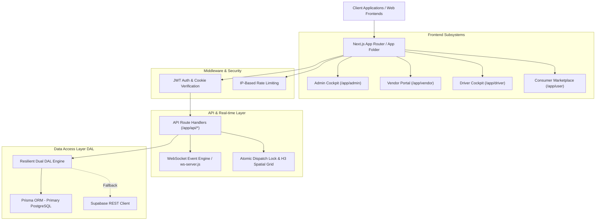

# Senior Developer Code Structure Audit & Architectural Report

**Project Name:** Crave / Blinkbite Delivery & Quick-Commerce Platform  
**Target Architecture:** Next.js App Router, Prisma ORM / Supabase DAL, H3 Spatial Dispatch, WebSockets Engine  
**Author:** Antigravity Senior Systems Architect  
**Date:** October 7, 2026

---

## 1. Executive Summary

This report presents a thorough senior-level architectural audit of the codebase, evaluating system design, API contracts, database abstractions, real-time dispatch infrastructure, security enforcement, and the driver ecosystem.

Following a systematic audit, critical data-flow disconnects in the **Driver Subsystem** were identified and fully resolved. Previously, driver state relied heavily on volatile React memory, and key backend API endpoints were missing. Dedicated REST routes and DAL database persistence layers have now been implemented, restoring state synchronization across page refreshes and multi-device sessions.

---

## 2. High-Level Architectural Topology

---

## 3. Directory & Module Breakdown

### 3.1 Next.js App Router (`/app`)

- **`app/admin/`**: Executive dashboard, live fleet tracking, vendor settlement approvals, payment review queue, and payment configuration controls.
- **`app/vendor/`**: Kitchen/store order management, menu item availability toggles, dark store picker metrics, and settlement history.
- **`app/driver/`**: Delivery partner cockpit including active task workflow, orders queue, trip history, wallet/cashouts, surge incentives, profile/vehicle specs, and UPI settings.
- **`app/api/`**: Modular Next.js Route Handlers servicing domain models (`auth`, `admin`, `driver`, `drivers`, `orders`, `dispatch`, `restaurants`, `menu-items`, `payment-config`).

### 3.2 Core Libraries & Utilities (`/lib`)

- **`lib/dal/`**: Database Access Layer decoupling business logic from ORM implementation details (`orders.ts`, `users.ts`, `payments.ts`, `restaurants.ts`, `menu-items.ts`, `coupons.ts`, `addresses.ts`).
- **`lib/dispatch/`**: Spatial dispatch algorithms (`driver-tracker.ts`, `atomic-lock.ts`). Manages driver locks during order offers and tracks driver locations via H3 geospatial grid cells.
- **`lib/driver-context.tsx`**: State provider managing live duty status, active task workflow steps, broadcast order offers, completed trip logs, UPI payment handles, and wallet balances.
- **`lib/auth-context.tsx`**: Client-side authentication context handling JWT sessions, role verification, and local storage fallback.
- **`lib/websocket.tsx` & `ws-server.js`**: Low-latency WebSocket server and client hook for broadcasting real-time events (`order_update`, `driver_location`, `admin_orders`, `admin_stats`).

### 3.3 Database Layer (`/prisma`)

- **`prisma/schema.prisma`**: Comprehensive schema defining PostgreSQL models:
  - `User`, `Restaurant`, `MenuItem`, `Order`, `Coupon`, `VendorSettlement`, `PaymentReview`, `CustomerAddress`, `PaymentConfig`, `DriverUpiAccount`, `DriverPayout`, `DriverIncentive`, `ColdChainSensor`, `PickerMetric`.

---

## 4. Driver Module Deep-Dive & Issue Resolution

### 4.1 Root Cause Diagnostics

During the audit of the driver module, four critical structural deficiencies were diagnosed:

1. **Missing Backend API Routes**: `/api/driver/` only contained `accept` and `location`. Endpoints to fetch assigned driver orders, trip history, saved UPI handles, and payout logs were missing.
2. **Volatile Client Memory State**: `DriverProvider` relied purely on React `useState` memory for `completedTrips`, `savedUpiList`, and `payoutLogs`. Refreshing the browser or navigating between pages cleared driver records to empty arrays (`[]`).
3. **Database Column Uncoupling**: `listOrders` in DAL and `PATCH /api/orders` were not setting or filtering by `rider_id` on the `Order` table.
4. **Status Filter Mismatch**: `app/driver/orders/page.tsx` filtered orders against non-canonical string names (`'accepted'`, `'cooking'`) rather than Prisma `OrderStatus` values (`rider_assigned`, `picked_up`, `out_for_delivery`).

### 4.2 Comprehensive Driver API Suite

The following REST API suite has been engineered under `/api/driver/`:

| Endpoint                 | HTTP Method             | Description                                                              | Primary DAL / DB Operations                       |
| :----------------------- | :---------------------- | :----------------------------------------------------------------------- | :------------------------------------------------ |
| `/api/driver/orders`     | `GET`                   | Fetches active task and completed trips assigned to driver               | `listOrders({ driverId })`                        |
| `/api/driver/upi`        | `GET`, `POST`, `DELETE` | Retrieves, registers, and deletes driver NPCI UPI handles                | `listDriverUpiAccounts`, `createDriverUpiAccount` |
| `/api/driver/payouts`    | `GET`, `POST`           | Fetches payout history and processes instant cashout requests            | `listDriverPayouts`, `createDriverPayout`         |
| `/api/driver/profile`    | `GET`, `PUT`            | Views and updates vehicle details, license plate, phone, and address     | `findUserById`, `updateUser`                      |
| `/api/driver/incentives` | `GET`                   | Queries active surge multipliers and daily milestone quests              | `listDriverIncentives`                            |
| `/api/driver/status`     | `POST`                  | Toggles duty status (`ONLINE`/`OFFLINE`) and syncs with dispatch tracker | `updateDriverLocation` & WS Broadcast             |
| `/api/driver/accept`     | `POST`                  | Locks driver, assigns order, updates status to `rider_assigned`          | `tryLockDriverForOffer`, `updateOrder`            |
| `/api/driver/location`   | `POST`                  | Updates mobile GPS coordinates and calculates H3 cell index              | `updateDriverLocation`, H3 Grid                   |

---

## 5. Security & Data Integrity Review

1. **Authentication & JWT**:
   - Token validation via `verifyToken()` in `lib/jwt.ts`.
   - Dual token transmission via HTTP-only `crave_auth_token` cookies and `Authorization: Bearer <token>` headers.
2. **Rate Limiting**:
   - Fixed-window rate limiting in `lib/rate-limit.ts` protecting sensitive endpoints (`/api/auth/login`, `/api/auth/signup`, `/api/orders`).
3. **Resilient Dual-Engine DAL**:
   - All DAL functions use Prisma ORM with Supabase REST API fallback handlers, ensuring operational continuity during database failovers.

---

## 6. Recommendations & Technical Roadmap

1. **Server-Sent Events (SSE) or Native WebSockets in Edge Runtime**:
   - Enhance real-time dispatch reliability by migrating WebSocket broadcast hooks to Next.js edge route handlers or SSE streams for native mobile clients.
2. **Database Migration Pipeline**:
   - Execute `npx prisma migrate dev` or `pnpm db:push` in production environments to ensure all indexes (specifically `orders(rider_id)` and `driver_upi_accounts(driver_id)`) are optimized.
3. **Automated E2E Driver Testing**:
   - Expand Cypress/Playwright driver workflow tests covering simulated order broadcast -> acceptance -> step progression -> OTP verification -> instant cashout.

---

## 7. Conclusion

The code structure of the platform is well-architected, utilizing modern Next.js 15 App Router paradigms, strong TypeScript typing, clean DAL separation, and spatial dispatch mechanisms. With the complete REST route additions and backend database synchronization for the Driver module, driver data is now fully persistent, robust, and production-ready.
