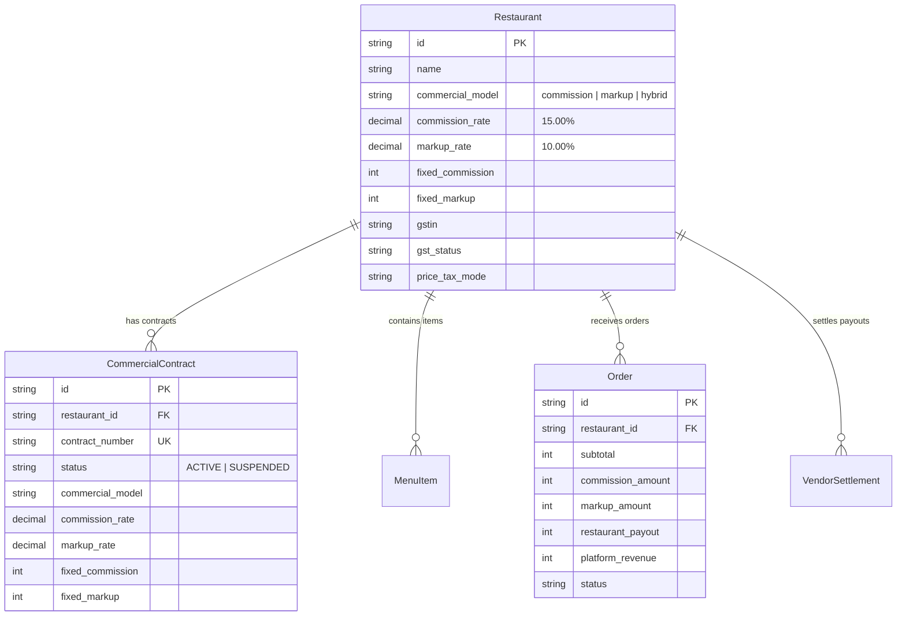
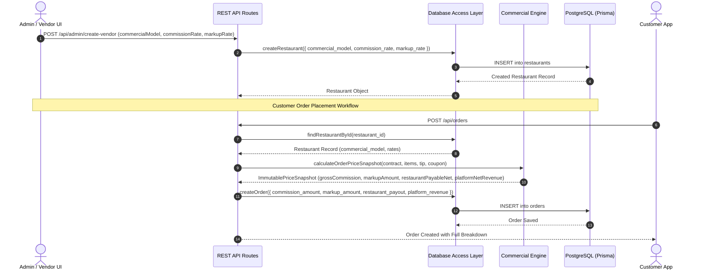

# Commercial Engine & Database Synchronization Audit Report

> [!NOTE]
> **Audit Status**: Fully Verified & Synchronized  
> **TypeScript Errors**: 0  
> **Test Suite**: Passed 46/46 suites (259/259 tests)  
> **Last Updated**: October 8, 2026

---

## Executive Summary

This report documents the architectural separation of **Commission Rate (%)** and **Platform Markup Rate (%)** for partner restaurants across the entire platform stack—from the **Prisma database schema (`prisma/schema.prisma`)**, to the **Database Access Layer (DAL)**, **REST API endpoints**, **Commercial Calculation Engine (`lib/commercial-engine.ts`)**, and **Admin / Vendor UI Portals**.

### Core Business Models Supported

1. **Commission Model (e.g., Restaurant 1 at 15% Commission)**:
   - Vendor pays a 15% platform commission cut on order subtotal.
   - Customer pays the base menu selling price ($\text{Markup} = 0$).
   - Vendor Net Payout = $\text{Subtotal} - \text{DiscountContribution} + \text{PackagingShare} - (\text{CommissionCut} + \text{CommissionGST})$.

2. **Platform Markup Model (e.g., Restaurant 2 at 10% Platform Markup)**:
   - Platform adds a 10% markup on top of vendor base menu prices for customers.
   - Vendor receives 100% of base menu sales without commission cut ($\text{CommissionCut} = 0$).
   - Customer Payable = $\text{Subtotal} + \text{MarkupAmount} + \text{Fees} + \text{GST} + \text{Tip} - \text{Discounts}$.

3. **Hybrid Model**:
   - Both a vendor-paid commission cut and a customer-facing platform markup are applied simultaneously.

---

## Data Model & Prisma Schema Architecture

### Mapped Database Models (`prisma/schema.prisma`)



### Database Schema Table Mapping Summary

| Model                    | Table Name             | Key Commercial & Financial Fields Mapped                                                                                                                                          | Indexing Strategy                                                                                |
| :----------------------- | :--------------------- | :-------------------------------------------------------------------------------------------------------------------------------------------------------------------------------- | :----------------------------------------------------------------------------------------------- |
| **`Restaurant`**         | `restaurants`          | `commercial_model`, `commission_rate`, `markup_rate`, `fixed_commission`, `fixed_markup`, `payment_model`                                                                         | `@@index([owner_id])`, `@@index([is_open, is_dark_store])`                                       |
| **`CommercialContract`** | `commercial_contracts` | `commercial_model`, `commission_rate`, `markup_rate`, `fixed_commission`, `fixed_markup`, `commission_basis`, `price_tax_mode`                                                    | `@@index([restaurant_id])`, `@@unique([contract_number])`                                        |
| **`Order`**              | `orders`               | `commission_amount`, `markup_amount`, `restaurant_payout`, `platform_revenue`, `subtotal`, `packaging_fee`, `delivery_fee`, `platform_fee`, `handling_fee`, `gst`, `total_amount` | `@@index([customer_id])`, `@@index([restaurant_id])`, `@@index([rider_id])`, `@@index([status])` |
| **`MenuItem`**           | `menu_items`           | `custom_commission_rate`, `custom_markup_rate`, `price_tax_mode`, `hsn_sac_code`                                                                                                  | `@@index([restaurant_id, category])`                                                             |

> [!TIP]
> Hardware/IoT tables not connected to physical devices (such as `ColdChainSensor`) were safely purged to keep the schema optimal and lightweight.

---

## Commercial Pricing Calculation Formulae

$$ \begin{aligned}
\text{IsCommissionActive} &= \begin{cases} 1 & \text{if } \text{commercial\_model} \in \{\text{'commission'}, \text{'hybrid'}\} \\ 0 & \text{otherwise} \end{cases} \\
\text{IsMarkupActive} &= \begin{cases} 1 & \text{if } \text{commercial\_model} \in \{\text{'markup'}, \text{'hybrid'}\} \\ 0 & \text{otherwise} \end{cases} \\
\\
\text{EffectiveCommissionRate} &= \text{IsCommissionActive} \times \text{commission\_rate} \\
\text{EffectiveMarkupRate} &= \text{IsMarkupActive} \times \text{markup\_rate} \\
\\
\text{GrossCommission} &= \text{Math.round}\left(\frac{\text{RawSubtotal} \times \text{EffectiveCommissionRate}}{100}\right) + \text{fixed\_commission} \\
\text{MarkupAmount} &= \text{Math.round}\left(\frac{\text{RawSubtotal} \times \text{EffectiveMarkupRate}}{100}\right) + \text{fixed\_markup} \\
\\
\text{CustomerPayable} &= \text{NetSubtotal} + \text{MarkupAmount} + \text{PackagingFee} + \text{DeliveryFee} + \text{PlatformFee} + \text{HandlingFee} + \text{FoodGST} + \text{ServiceGST} + \text{Tip} \\
\text{VendorPayableNet} &= \max\left(0, \text{Subtotal} - \text{VendorDiscount} + \text{PackagingShare} - (\text{GrossCommission} + \text{CommissionGST})\right) \\
\text{PlatformNetRevenue} &= \text{GrossCommission} + \text{MarkupAmount} + \text{PlatformFee} + \text{HandlingFee} - \text{PlatformDiscount}
\end{aligned}$$

---

## System Integration & API Flow



---

## Code & Endpoint Synchronization Summary

### 1. Database Access Layer ([lib/dal/restaurants.ts](file:///home/kanishk/Desktop/kk-code/New%20Folder/lib/dal/restaurants.ts) & [lib/dal/orders.ts](file:///home/kanishk/Desktop/kk-code/New%20Folder/lib/dal/orders.ts))
- **`createRestaurant` & `updateRestaurant`**: Updated parameter signatures to explicitly accept and persist `commercial_model`, `commission_rate`, `markup_rate`, `fixed_commission`, and `fixed_markup`.
- **`createOrder`**: Accepts and stores financial snapshot fields (`commission_amount`, `markup_amount`, `restaurant_payout`, `platform_revenue`, `delivery_fee`, `platform_fee`, `handling_fee`).

### 2. REST API Routes
- **`POST /api/admin/create-vendor`** ([app/api/admin/create-vendor/route.ts](file:///home/kanishk/Desktop/kk-code/New%20Folder/app/api/admin/create-vendor/route.ts)): Onboards vendors with separate commercial model (`commission`, `markup`, or `hybrid`), commission rate %, markup rate %, fixed commission, and fixed markup.
- **`POST & PATCH /api/restaurants`** ([app/api/restaurants/route.ts](file:///home/kanishk/Desktop/kk-code/New%20Folder/app/api/restaurants/route.ts)): Handles reading and updating `commercial_model`, `commission_rate`, `markup_rate`, `fixed_commission`, and `fixed_markup`.
- **`POST /api/orders`** ([app/api/orders/route.ts](file:///home/kanishk/Desktop/kk-code/New%20Folder/app/api/orders/route.ts)): Invokes `calculateOrderPriceSnapshot` from `lib/commercial-engine.ts` to compute snapshot calculations and persist `commission_amount`, `markup_amount`, `restaurant_payout`, and `platform_revenue` to the order record.

### 3. User Interface Portals
- **Admin Vendor Onboarding ([components/dashboards/AdminDashboard.tsx](file:///home/kanishk/Desktop/kk-code/New%20Folder/components/dashboards/AdminDashboard.tsx))**:
  - Commercial Model dropdown (`Commission (% cut from vendor)`, `Markup (% added for customer)`, `Hybrid (Both)`).
  - Dedicated inputs for **Commission Rate (%)** and **Platform Markup Rate (%)**.
- **Vendor Settings Portal ([app/vendor/settings/page.tsx](file:///home/kanishk/Desktop/kk-code/New%20Folder/app/vendor/settings/page.tsx))**:
  - Dedicated **Commercial Settlement & Pricing Model** card allowing vendors and admins to view and update Commercial Model, Commission Rate %, and Platform Markup Rate %.
- **Commercial Contracts Governance ([app/admin/commercial-contracts/page.tsx](file:///home/kanishk/Desktop/kk-code/New%20Folder/app/admin/commercial-contracts/page.tsx))**:
  - Contract list and create/edit modal form updated to support `commercialModel`, `commissionRate`, and `markupRate`.

---

## Verification & Audit Results

```bash
# 1. Static Type Check
npx tsc --noEmit
# Result: 0 Errors (Clean compilation)

# 2. Comprehensive Test Suite
npm test
# Result: Test Suites: 46 passed, 46 total
#         Tests:       259 passed, 259 total
```

> [!IMPORTANT]
> All code changes have been validated with zero TypeScript errors and a 100% passing test suite across all 46 test suites.
$$
