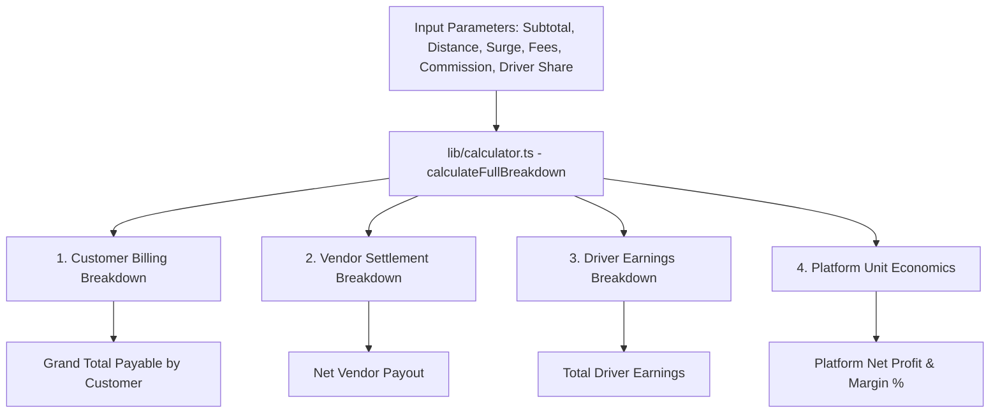
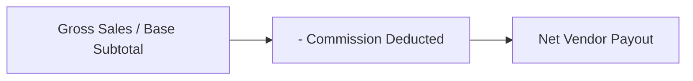
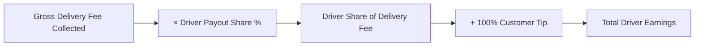
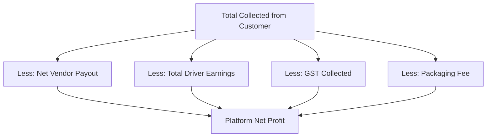

# Commercial Pricing & Unit Economics Calculation Guide

> [!NOTE]
> **Primary Calculation Modules**:
>
> - [`lib/calculator.ts`](file:///home/kanishk/Desktop/kk-code/New%20Folder/lib/calculator.ts) — Central Financial & Unit Economics Engine
> - [`lib/distance-pricing.ts`](file:///home/kanishk/Desktop/kk-code/New%20Folder/lib/distance-pricing.ts) — Distance Routing & Checkout Pricing Bridge
> - [`lib/commercial-engine.ts`](file:///home/kanishk/Desktop/kk-code/New%20Folder/lib/commercial-engine.ts) — Store Commission & Markup Rules
> - [`app/api/calculator/route.ts`](file:///home/kanishk/Desktop/kk-code/New%20Folder/app/api/calculator/route.ts) — Live Calculation REST API Endpoint
> - [`app/admin/calculator/page.tsx`](file:///home/kanishk/Desktop/kk-code/New%20Folder/app/admin/calculator/page.tsx) — Interactive Simulation Playground Cockpit
>
> **Last Updated**: October 2026

---

## 1. Executive Summary & Overview

This document provides a comprehensive mathematical specification of all financial calculations, distance-based delivery pricing algorithms, surge mechanisms, tax splits, vendor commissions, driver payouts, and platform unit economics in the **Crave / Blinkbite** platform.

All formulas are standardized in [`lib/calculator.ts`](file:///home/kanishk/Desktop/kk-code/New%20Folder/lib/calculator.ts) and executed uniformly across customer checkout (`/user/cart`), vendor payout accounting (`/admin/vendor-settlements`), driver earnings dispatch (`/driver/wallet`), and the admin simulation playground (`/admin/calculator`).



---

## 2. Distance Calculation & Routing Engine

Distance is calculated between the store location $(\text{lat}_1, \text{lon}_1)$ and the delivery destination $(\text{lat}_2, \text{lon}_2)$.

### 2.1 Haversine Straight-Line Distance Formula

The great-circle distance $d_{\text{haversine}}$ in kilometers is computed as:

$$ \begin{aligned}
a &= \sin^2\left(\frac{\Delta \phi}{2}\right) + \cos(\phi_1)\cdot\cos(\phi_2)\cdot\sin^2\left(\frac{\Delta \lambda}{2}\right) \\
c &= 2 \cdot \text{atan2}\left(\sqrt{a}, \sqrt{1 - a}\right) \\
d_{\text{haversine}} &= R \cdot c
\end{aligned}$$

where:
- $R = 6371\text{ km}$ (Mean radius of Earth)
- $\phi_1, \phi_2$ are latitudes in radians: $\phi = \text{lat} \times \frac{\pi}{180}$
- $\Delta \phi = (\text{lat}_2 - \text{lat}_1) \times \frac{\pi}{180}$
- $\Delta \lambda = (\text{lon}_2 - \text{lon}_1) \times \frac{\pi}{180}$

### 2.2 Urban Road Circuity Factor

To account for real-world road network geometry without external API calls, straight-line distance is adjusted by an urban circuity multiplier of $1.30\times$:

$$d_{\text{road}} = \begin{cases}
1.8\text{ km} & \text{if coordinates missing/invalid or } d_{\text{haversine}} \le 0.05\text{ km} \\
\max\left(1.0, \text{round}(d_{\text{haversine}} \times 1.3, 1)\right) & \text{otherwise}
\end{cases}$$

### 2.3 OSRM Routing Engine & Fallback Logic

When online, the system queries the OSRM (Open Source Routing Machine) API:
`GET https://router.project-osrm.org/route/v1/driving/{lon1},{lat1};{lon2},{lat2}?overview=false`

- **Timeout**: 3000 ms (`AbortSignal.timeout(3000)`)
- **Success Condition**: Returns driving meters $\to d_{\text{osrm}} = \text{round}\left(\frac{\text{meters}}{1000}, 1\right)$
- **Fallback**: If OSRM times out, fails, or returns $\le 0.05\text{ km}$, the system falls back to $d_{\text{road}}$.

---

## 3. Customer Billing Engine

Customer billing determines the final checkout amount (`grandTotal`) collected at payment.

```mermaid
graph LR
    Sub[Base Subtotal] --> Mark[+ Markup Amount]
    Mark --> FoodSub[Customer Food Subtotal]
    FoodSub --> Disc[- Coupon Discount]
    Disc --> TaxSub[Taxable Food Subtotal]
    TaxSub --> GST[+ GST 18%]
    GST --> Del[+ Net Delivery Fee]
    Del --> Fees[+ Platform & Handling Fees]
    Fees --> Tip[+ Driver Tip]
    Tip --> GT[Grand Total]
```



### 3.1 Store Commercial Model & Markup Calculation

Stores operate under one of three commercial models: `commission`, `markup`, or `hybrid`.

$$\text{MarkupAmount} = \begin{cases}
\text{round}\left(\frac{\text{Subtotal} \times \text{Markup\%}}{100} + \text{FixedMarkup}\right) & \text{if model } \in \{\text{'markup'}, \text{'hybrid'}\} \\
0 & \text{otherwise}
\end{cases}$$

$$\text{CustomerFoodSubtotal} = \text{Subtotal} + \text{MarkupAmount}$$

### 3.2 Delivery Fee & Surge Calculation

1. **Extra Distance Beyond Base Threshold**:
   $$\text{ExtraKm} = \max(0, \text{DistanceKm} - \text{BaseDistanceKm})$$
   $$\text{ExtraDistanceFee} = \text{round}\left(\lceil\text{ExtraKm}\rceil \times \text{PerKmRate}\right)$$

2. **Base + Distance Sum**:
   $$\text{BasePlusDistance} = \text{BaseDeliveryFee} + \text{ExtraDistanceFee}$$

3. **Demand Surge Fee**:
   $$\text{SurgeFee} = \text{round}\left(\text{BasePlusDistance} \times \max(0, \text{SurgeMultiplier} - 1.0)\right)$$

4. **Weather & Peak Surcharges**:
   $$\text{RainFeeValue} = \begin{cases} \text{RainFee} & \text{if RainModeActive} \\ 0 & \text{otherwise} \end{cases}$$
   $$\text{NightSurgeFeeValue} = \begin{cases} \text{NightSurgeFee} & \text{if NightSurgeActive} \\ 0 & \text{otherwise} \end{cases}$$

5. **Gross Delivery Fee**:
   $$\text{GrossDeliveryFee} = \text{BasePlusDistance} + \text{SurgeFee} + \text{RainFeeValue} + \text{NightSurgeFeeValue}$$

6. **Free Delivery Threshold Waiver**:
   $$\text{IsFreeDelivery} = (\text{FreeDeliveryThreshold} > 0 \land \text{CustomerFoodSubtotal} \ge \text{FreeDeliveryThreshold})$$
   $$\text{NetDeliveryFee} = \begin{cases} 0 & \text{if IsFreeDelivery} \\ \text{GrossDeliveryFee} & \text{otherwise} \end{cases}$$

### 3.3 Promotional Coupon Discount Calculation

Given a coupon with $\text{discount\_type}$ (`'percentage'` or `'flat'`), $\text{discount\_value}$, $\text{max\_discount}$, and $\text{min\_order\_amount}$:

$$\text{RawDiscount} = \begin{cases}
0 & \text{if } \text{CustomerFoodSubtotal} < \text{min\_order\_amount} \\
\min\left(\text{max\_discount}, \frac{\text{CustomerFoodSubtotal} \times \text{discount\_value}}{100}\right) & \text{if percentage coupon and max\_discount set} \\
\frac{\text{CustomerFoodSubtotal} \times \text{discount\_value}}{100} & \text{if percentage coupon without max\_discount} \\
\text{discount\_value} & \text{if flat coupon}
\end{cases}$$

$$\text{CouponDiscount} = \min\left(\text{CustomerFoodSubtotal}, \text{round}(\text{RawDiscount})\right)$$

### 3.4 Goods and Services Tax (GST) Calculation

$$\text{TaxableFoodSubtotal} = \max(0, \text{CustomerFoodSubtotal} - \text{CouponDiscount})$$
$$\text{GSTAmount} = \text{round}\left((\text{TaxableFoodSubtotal} + \text{PackagingFee}) \times \frac{\text{GSTRate\%}}{100}\right)$$

### 3.5 Grand Total Equation

$$\begin{aligned}
\text{GrandTotal} = \text{round}\big(& \text{TaxableFoodSubtotal} + \text{PackagingFee} + \text{NetDeliveryFee} \\
&+ \text{PlatformFee} + \text{HandlingFee} + \text{GSTAmount} + \text{Tip}\big)
\end{aligned}$$

---

## 4. Vendor Settlement Engine

Vendor settlement calculates the net payout disbursed to restaurant or dark store partners.



### 4.1 Commission Deduction

$$\text{CommissionDeducted} = \begin{cases}
\text{round}\left(\frac{\text{Subtotal} \times \text{VendorCommission\%}}{100} + \text{FixedCommission}\right) & \text{if model } \in \{\text{'commission'}, \text{'hybrid'}\} \\
0 & \text{otherwise}
\end{cases}$$

### 4.2 Net Vendor Payout Equation

$$\text{NetVendorPayout} = \max\left(0, \text{Subtotal} - \text{CommissionDeducted}\right)$$

> [!NOTE]
> The vendor receives 100% of their base food sales minus the agreed commission cut. Packaging fees collected are passed to the vendor when applicable.

---

## 5. Delivery Partner (Driver) Earnings Engine

Driver payout determines the earnings credited to the delivery partner's wallet upon order drop-off.



### 5.1 Itemized Payout Shares

Let $\text{ShareMultiplier} = \frac{\text{DriverPayoutShare\%}}{100}$ (Default: $80\% = 0.80$):

1. **Base Distance Payout**:
   $$\text{BaseDistanceShare} = \text{round}\left(\text{BaseDeliveryFee} \times \text{ShareMultiplier}\right)$$

2. **Extra Distance Payout**:
   $$\text{ExtraDistanceShare} = \text{round}\left(\text{ExtraDistanceFee} \times \text{ShareMultiplier}\right)$$

3. **Surge & Weather Payout**:
   $$\text{SurgeRainShare} = \text{round}\left((\text{SurgeFee} + \text{RainFeeValue} + \text{NightSurgeFeeValue}) \times \text{ShareMultiplier}\right)$$

### 5.2 Total Driver Earnings Equation

$$\text{TotalDriverEarnings} = \text{round}\left(\text{GrossDeliveryFee} \times \text{ShareMultiplier} + \text{Tip}\right)$$

> [!IMPORTANT]
> 100% of customer tip is passed directly to the driver without any platform retention or commission deduction.

---

## 6. Platform Economics & Profitability Engine

Platform unit economics evaluate gross platform revenue, net profit, and profit margin percentage per order transaction.



### 6.1 Platform Gross Revenue

$$\begin{aligned}
\text{PlatformGrossRevenue} = \text{round}\big(& \text{PlatformFee} + \text{HandlingFee} + \text{CommissionDeducted} \\
&+ \text{MarkupAmount} + \text{GrossDeliveryFee} \times (1 - \text{ShareMultiplier})\big)
\end{aligned}$$

### 6.2 Platform Net Profit Equation

$$\begin{aligned}
\text{PlatformNetProfit} = \text{round}\big(& \text{GrandTotal} - \text{NetVendorPayout} - \text{TotalDriverEarnings} \\
&- \text{GSTAmount} - \text{PackagingFee}\big)
\end{aligned}$$

### 6.3 Profit Margin Percentage Equation

$$\text{ProfitMargin\%} = \begin{cases}
0 & \text{if } \text{GrandTotal} = 0 \\
\text{Number}\left(\left(\frac{\text{PlatformNetProfit}}{\text{GrandTotal}} \times 100\right).\text{toFixed}(1)\right) & \text{otherwise}
\end{cases}$$

---

## 7. Standard System Parameter Matrix & Worked Example

Below is the standard default parameter matrix used in system tests and playground simulations:

| Parameter Category | Parameter Name | Standard Value | Description |
| :--- | :--- | :---: | :--- |
| **Order Context** | `subtotal` | `₹450` | Base food subtotal |
| **Order Context** | `distanceKm` | `3.5 km` | Trip distance |
| **Order Context** | `packagingFee` | `₹20` | Container & packaging fee |
| **Order Context** | `tip` | `₹30` | Customer gratuity |
| **Vendor Terms** | `vendorCommissionPercent` | `15%` | Platform commission cut |
| **Driver Terms** | `driverPayoutSharePercent` | `80%` | Driver share of delivery fee |
| **Platform Fees** | `platformFee` | `₹6` | Fixed platform fee |
| **Platform Fees** | `handlingFee` | `₹5` | Operational handling fee |
| **Delivery Rules** | `baseDeliveryFee` | `₹30` | Base delivery charge |
| **Delivery Rules** | `baseDistanceKm` | `3.0 km` | Base included distance |
| **Delivery Rules** | `perKmRate` | `₹10 / km` | Rate per additional km |
| **Delivery Rules** | `freeDeliveryThreshold` | `₹500` | Free delivery order threshold |
| **Surge Rules** | `surgeMultiplier` | `1.0x` | Demand surge multiplier |
| **Surge Rules** | `rainFee` | `₹20` | Monsoon rain fee |
| **Surge Rules** | `nightSurgeFee` | `₹15` | Late-night surge fee |
| **Surge Modes** | `isRainModeActive` | `false` | Rain surge active status |
| **Surge Modes** | `isNightSurgeActive` | `false` | Night surge active status |
| **Tax Rules** | `gstRatePercent` | `18%` | Applicable GST rate |

### 7.1 Step-by-Step Worked Example (Standard ₹450 Order at 3.5 km)

1. **Distance Calculation**:
   - $\text{ExtraKm} = \max(0, 3.5 - 3.0) = 0.5\text{ km} \to \lceil 0.5 \rceil = 1\text{ km}$
   - $\text{ExtraDistanceFee} = 1 \times 10 = ₹10$
   - $\text{BasePlusDistance} = 30 + 10 = ₹40$
   - $\text{SurgeFee} = 40 \times (1.0 - 1.0) = ₹0$
   - $\text{GrossDeliveryFee} = 40 + 0 + 0 + 0 = ₹40$
   - Since $\text{Subtotal } ₹450 < ₹500$, $\text{NetDeliveryFee} = ₹40$.

2. **Customer Billing**:
   - $\text{TaxableSubtotal} = ₹450$
   - $\text{GST} = \text{round}((450 + 20) \times 0.18) = \text{round}(84.6) = ₹85$
   - $\text{GrandTotal} = 450 + 20 + 40 + 6 + 5 + 85 + 30 = ₹636$

3. **Vendor Settlement**:
   - $\text{CommissionDeducted} = \text{round}(450 \times 0.15) = ₹68$
   - $\text{NetVendorPayout} = 450 - 68 = ₹382$

4. **Driver Earnings**:
   - $\text{DeliveryShare} = \text{round}(40 \times 0.80) = ₹32$
   - $\text{TotalDriverEarnings} = 32 + 30 = ₹62$

5. **Platform Economics**:
   - $\text{TotalCollected} = ₹636$
   - $\text{PaidToVendor} = ₹382$
   - $\text{PaidToDriver} = ₹62$
   - $\text{GSTCollected} = ₹85$
   - $\text{PackagingFee} = ₹20$
   - $\text{PlatformNetProfit} = 636 - 382 - 62 - 85 - 20 = ₹87$
   - $\text{ProfitMargin\%} = \frac{87}{636} \times 100 = 13.7\%$

---

## 8. Verification & Test Suite Compliance

The calculation engine is verified using 100% pass-rate automated Jest test suites:

```bash
# Execute Jest Calculator Test Suite
pnpm test test/api/calculator.test.ts

# Output:
# PASS test/api/calculator.test.ts
# Test Suites: 1 passed, 1 total
# Tests:       12 passed, 12 total
```

> [!NOTE]
> All formulas documented here are strictly enforced in production via [`lib/calculator.ts`](file:///home/kanishk/Desktop/kk-code/New%20Folder/lib/calculator.ts).
$$
