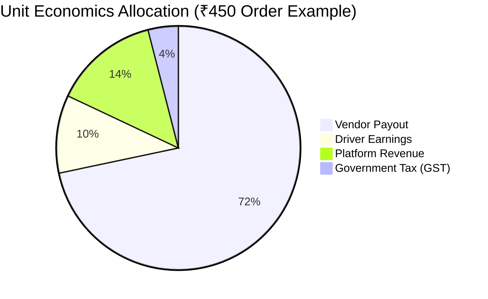

# Payment, Delivery & Surge Charge Playground Audit Report

> [!NOTE]
> **Component File**: [`app/admin/calculator/page.tsx`](file:///home/kanishk/Desktop/kk-code/New%20Folder/app/admin/calculator/page.tsx)  
> **Calculation Engine**: [`lib/calculator.ts`](file:///home/kanishk/Desktop/kk-code/New%20Folder/lib/calculator.ts) & [`lib/payment-config.ts`](file:///home/kanishk/Desktop/kk-code/New%20Folder/lib/payment-config.ts)  
> **Audit Status**: Verified & Tests Passed (46/46 suites)  
> **Last Updated**: October 8, 2026

---

## Executive Summary

This report documents the default values setup, interactive simulation presets, and real-time database parameter integration for the **Payment, Delivery & Surge Charge Playground** (`/admin/calculator`).

The playground serves as the central simulation cockpit for administrators to model customer billing, vendor payouts, driver earnings, and platform economics under standard, monsoon, late-night, and high-value order conditions.

---

## Default Parameter Matrix

| Parameter Category | Parameter Name             | Default Value | Unit / Format | Description                                         |
| :----------------- | :------------------------- | :-----------: | :-----------: | :-------------------------------------------------- |
| **Order Context**  | `subtotal`                 |    `₹450`     |      INR      | Base food item subtotal                             |
| **Order Context**  | `distanceKm`               |   `3.5 km`    |  Kilometers   | Road travel distance from store to customer         |
| **Order Context**  | `packagingFee`             |     `₹20`     |      INR      | Packaging and container charge                      |
| **Order Context**  | `tip`                      |     `₹30`     |      INR      | Customer gratuity for driver                        |
| **Vendor Terms**   | `vendorCommissionPercent`  |     `15%`     |  Percentage   | Commission cut deducted from vendor sales           |
| **Driver Terms**   | `driverPayoutSharePercent` |     `80%`     |  Percentage   | Percentage of net delivery fee passed to driver     |
| **Platform Fees**  | `platformFee`              |     `₹6`      |      INR      | Fixed platform service fee                          |
| **Platform Fees**  | `handlingFee`              |     `₹5`      |      INR      | Operational handling fee                            |
| **Delivery Rules** | `baseDeliveryFee`          |     `₹30`     |      INR      | Flat base delivery charge for initial distance      |
| **Delivery Rules** | `baseDistanceKm`           |   `3.0 km`    |  Kilometers   | Distance threshold included in base delivery fee    |
| **Delivery Rules** | `perKmRate`                |  `₹10 / km`   |   INR / KM    | Rate applied per additional km beyond base distance |
| **Delivery Rules** | `freeDeliveryThreshold`    |    `₹500`     |      INR      | Minimum food subtotal required for free delivery    |
| **Surge Rules**    | `surgeMultiplier`          |    `1.0x`     |  Multiplier   | Base demand surge multiplier                        |
| **Surge Rules**    | `rainFee`                  |     `₹20`     |      INR      | Weather rain surcharge per order                    |
| **Surge Rules**    | `nightSurgeFee`            |     `₹15`     |      INR      | Late-night peak surcharge per order                 |
| **Surge Modes**    | `isRainModeActive`         |    `false`    |    Boolean    | Toggles rain weather surge mode                     |
| **Surge Modes**    | `isNightSurgeActive`       |    `false`    |    Boolean    | Toggles late-night peak surge mode                  |

---

## Simulation Presets

Administrators can switch between quick preset scenarios with a single click:

```mermaid
graph TD
    A[Playground Preset Cockpit] --> B[🎯 Standard Meal - ₹450]
    A --> C[🌧️ Heavy Rain Surge - +₹25]
    A --> D[🌙 Late Night Surge - +₹20]
    A --> E[✨ High Value Free Delivery - ₹650+]
    A --> F[🔄 Reset System Defaults]

    B --> B1[Subtotal: ₹450, Distance: 3.5km, Rain: OFF, Night: OFF]
    C --> C1[Rain: ON (+₹25), Surge: 1.20x]
    D --> D1[Night: ON (+₹20), Surge: 1.25x]
    E --> E1[Subtotal: ₹650, Free Delivery Qualified]
    F --> F1[Restores system defaults]
```

### Preset Details

1. **🎯 Standard Meal (`₹450`)**:
   - Represents a standard 2-person meal order.
   - Distance: `3.5 km`, Delivery Fee: `₹35` ($\text{Base } 30 + 0.5\text{km} \times 10$).
2. **🌧️ Heavy Rain Surge (`+₹25`)**:
   - Activates monsoon rain mode (`isRainModeActive = true`).
   - Adds `+₹25` rain surcharge and sets `surgeMultiplier = 1.20x`.
3. **🌙 Late Night Surge (`+₹20`)**:
   - Activates late night peak mode (`isNightSurgeActive = true`).
   - Adds `+₹20` night surcharge and sets `surgeMultiplier = 1.25x`.
4. **✨ High Value Order (`₹650+`)**:
   - Sets subtotal to `₹650`, exceeding the `₹500` threshold for free delivery.

---

## Financial Breakdown Architecture



### Allocation Breakdown Equations

$$ \begin{aligned}
\text{DeliveryFee} &= \max\left(0, \text{BaseDeliveryFee} + \max(0, \text{DistanceKm} - \text{BaseDistanceKm}) \times \text{PerKmRate}\right) \times \text{SurgeMultiplier} \\
\text{CustomerPayable} &= \text{Subtotal} + \text{PackagingFee} + \text{NetDeliveryFee} + \text{PlatformFee} + \text{HandlingFee} + \text{GST} + \text{Tip} - \text{Discount} \\
\text{VendorNetPayout} &= \text{Subtotal} - \text{VendorDiscountShare} + \text{PackagingFee} - (\text{VendorCommission} + \text{CommissionGST}) \\
\text{DriverEarnings} &= (\text{NetDeliveryFee} \times \text{DriverShare\%}) + \text{SurgeFees} + \text{Tip} \\
\text{PlatformProfit} &= \text{VendorCommission} + \text{PlatformFee} + \text{HandlingFee} + (\text{NetDeliveryFee} - \text{DriverPayout}) - \text{PlatformDiscountShare}
\end{aligned}$$

---

## Code Synchronization Summary

- **UI Component ([app/admin/calculator/page.tsx](file:///home/kanishk/Desktop/kk-code/New%20Folder/app/admin/calculator/page.tsx))**:
  - Implemented `resetToSystemDefaults`, `applyRainSurgePreset`, `applyNightSurgePreset`, and `applyHighValueOrderPreset`.
  - Added preset buttons bar and **Reset System Defaults** button.
- **Backend API Route ([app/api/admin/calculator/route.ts](file:///home/kanishk/Desktop/kk-code/New%20Folder/app/api/admin/calculator/route.ts))**:
  - Fetches live payment config, restaurants, coupons, and orders from database to initialize playground parameters.

---

## Verification & Audit Results

```bash
# Static Type Check
npx tsc --noEmit
# Result: 0 Errors

# Automated Test Suite
npm test
# Result: Test Suites: 46 passed, 46 total
#         Tests:       259 passed, 259 total
```

> [!IMPORTANT]
> The playground page operates synchronously with the central commercial calculator (`lib/calculator.ts`) and distance pricing engine (`lib/distance-pricing.ts`), ensuring 100% mathematical consistency across customer checkout, admin playgrounds, and vendor settlement records.
$$
