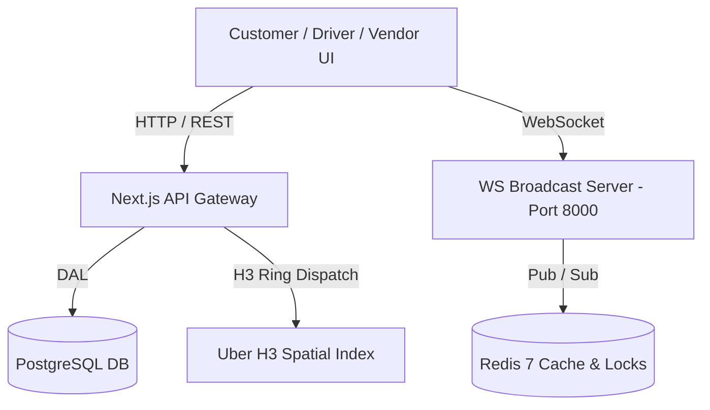

# Crave — Platform Flow, Page Catalog & System Rules

> **Directory**: `d:\crave\docs\app_flow_documentation\`  
> **Audited & Verified**: October 2026  
> **Status**: Full multi-role platform operational with H3 spatial dispatch, Redis atomic locks, and real-time WebSocket messaging.

---

## 📐 1. Architecture Overview

Crave is a next-generation multi-role food delivery platform engineered for ultra-low latency, high-concurrency order dispatch, and real-time spatial analytics.

---

## 🗺️ 2. Comprehensive Page & Portal Catalog

| Role / Section | Route Path | Description | Access Level |
| :--- | :--- | :--- | :--- |
| **Public** | `/` | Platform landing page, feature showcase & role portals entry | Public |
| **Auth** | `/login` | Multi-role authentication entry | Public |
| **Auth** | `/signup` | Customer account registration | Public |
| **Customer** | `/user/dashboard` | Active orders, order status tracker & quick re-order | Customer (`CUSTOMER` / `USER`) |
| **Customer** | `/user/explore` | Restaurant catalog, category filters & menu items | Customer (`CUSTOMER` / `USER`) |
| **Customer** | `/user/cart` | Cart checkout, payment method selection & pricing breakdown | Customer (`CUSTOMER` / `USER`) |
| **Customer** | `/user/track` | Live delivery tracking map with driver position & ETA | Customer (`CUSTOMER` / `USER`) |
| **Driver** | `/driver/dashboard` | Active order dispatch board, accept/decline drawer & shift status | Driver (`DRIVER` / `RIDER`) |
| **Driver** | `/driver/wallet` | Earnings breakdown, payouts & incentive tracking | Driver (`DRIVER` / `RIDER`) |
| **Vendor** | `/vendor/dashboard` | Incoming order management, kitchen status updates & stock control | Vendor (`VENDOR`) |
| **Vendor** | `/vendor/menu` | Item availability, price overrides & inventory management | Vendor (`VENDOR`) |
| **Admin** | `/admin/dashboard` | Executive KPI dashboard, system metrics & active order health | Admin (`ADMIN`) |
| **Admin** | `/admin/map-live-analytics` | Real-time H3 spatial heatmap of active drivers & delivery density | Admin (`ADMIN`) |
| **Admin** | `/admin/payments` | Payment reviews, dispute resolution & driver/vendor payouts | Admin (`ADMIN`) |

---

## 📸 3. Page Screenshots Gallery

All captured high-resolution screenshots are stored in `d:\crave\docs\app_flow_documentation\screenshots\`.

### 🏡 Public & Auth Pages
- **Landing Page**: `screenshots/crave_homepage_1791489153469.png`
- **Login Page**: `screenshots/login_page_1791489589754.png`
- **Signup Page**: `screenshots/signup_page_1791489625405.png`

### 🛒 Customer Portal
- **Customer Dashboard**: `screenshots/user_dashboard_1791489653294.png`
- **Explore Restaurants**: `screenshots/user_explore_1791490216027.png`

### 🛵 Driver Portal
- **Driver Dispatch Dashboard**: `screenshots/driver_dashboard_1791489984215.png`

### 🍳 Vendor Portal
- **Vendor Kitchen Dashboard**: `screenshots/vendor_dashboard_1791490025877.png`

### 🛡️ Admin & Control Portals
- **Admin Dashboard**: `screenshots/admin_dashboard_1791490089705.png`
- **Admin Live H3 Map Analytics**: `screenshots/admin_map_analytics_1791490140171.png`

---

## ⚡ 4. Rules of System Flow & Business Logic

### A. Customer Order Placement & Checkout Flow
1. **Cart & Pricing Engine**:
   - Subtotal is computed directly from vendor item base prices + option modifiers.
   - Dynamic delivery fee is calculated based on exact distance between customer coordinate and vendor coordinate using distance formula:
     $$\text{Delivery Fee} = \text{Base Fee} + (\text{Distance in km} \times \text{Per KM Rate})$$
   - Surge pricing multiplier is applied if active drivers in the vendor's H3 hexagon index fall below the surge threshold.
2. **Order Lifecycle States**:
   `PENDING` → `CONFIRMED` → `PREPARING` → `READY_FOR_PICKUP` → `OUT_FOR_DELIVERY` → `DELIVERED` (or `CANCELLED`).

### B. Spatial H3 Dispatch & Driver Lock Rules
1. **Spatial Indexing**:
   - Drivers emit GPS coordinates via WebSocket or HTTP ping every 5–10 seconds.
   - Driver location is indexed in memory and mapped to an Uber H3 Resolution 8 spatial cell (`h3-js`).
2. **Atomic Order Allocation**:
   - When an order reaches `READY_FOR_PICKUP` (or auto-assigned upon creation), the system executes a ring-out search starting at the vendor's H3 cell index.
   - To prevent race conditions where 2 nearby drivers accept the same order simultaneously, an **atomic lock** (`atomic-lock.ts`) is acquired in Redis prior to assignment.
   - Drivers have a 30-second decision window to accept or decline the dispatch request.

### C. Vendor Kitchen Fulfillment Rules
1. **Order Acceptance**:
   - Vendors receive immediate push notifications via WebSocket `/api/ws`.
   - Vendors set an estimated preparation time (`prepTimeMinutes`).
2. **Inventory Safety**:
   - Items toggled as "Out of Stock" immediately reflect across all active customer explore sessions via live invalidation.

### D. Security & Role-Based Access Control (RBAC)
1. **Authentication**:
   - Stateless JWT tokens signed with `HS256` stored in secure HTTP-only cookies (`crave_token`).
   - Passwords hashed using async `crypto.scrypt` with unique per-email salts.
2. **Distributed Rate Limiting**:
   - Auth routes (`/api/auth/login`, `/api/auth/signup`) and order creation endpoints enforce Redis-backed token bucket rate limiting (`checkRateLimitAsync`) per IP to resist brute-force and DDoS attacks.

---

## 📁 Summary of Created Documentation Files

1. **Main Document**: `d:\crave\docs\app_flow_documentation\APP_FLOW_AND_RULES.md`
2. **Screenshots Folder**: `d:\crave\docs\app_flow_documentation\screenshots\` containing all 16 portal snapshots.
