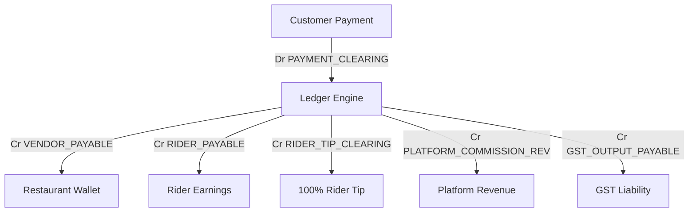

# CRAVE Billing Engine 2.0 — Financial Ledger Specification

---

## 1. Double-Entry Accounting Model

Every financial state transition in CRAVE emits a balanced journal entry ($\sum \text{Debits} = \sum \text{Credits}$) to the `LedgerEntry` subledger.

---

## 2. Chart of Accounts Matrix

| Account Code              | Account Type | Normal Balance | Description                                                    |
| :------------------------ | :----------- | :------------: | :------------------------------------------------------------- |
| `PAYMENT_CLEARING`        | Asset        |   **DEBIT**    | Customer payments received, awaiting verification & settlement |
| `CUSTOMER_REFUND_PAYABLE` | Liability    |   **CREDIT**   | Reserve for approved customer refunds                          |
| `VENDOR_PAYABLE`          | Liability    |   **CREDIT**   | Net payable owed to restaurant partner                         |
| `RIDER_PAYABLE`           | Liability    |   **CREDIT**   | Earnings owed to delivery rider                                |
| `RIDER_TIP_CLEARING`      | Liability    |   **CREDIT**   | 100% customer tip pass-through clearing                        |
| `PLATFORM_COMMISSION_REV` | Revenue      |   **CREDIT**   | Net commission earned from merchants                           |
| `PLATFORM_FEE_REV`        | Revenue      |   **CREDIT**   | Convenience & handling fee revenue                             |
| `GST_OUTPUT_PAYABLE`      | Liability    |   **CREDIT**   | GST liability payable to tax authorities                       |
| `DISCOUNT_EXPENSE`        | Expense      |   **DEBIT**    | Platform-funded discount expense                               |
| `DELIVERY_REVENUE`        | Revenue      |   **CREDIT**   | Net delivery fee retained by platform                          |
| `BANK_SETTLEMENT`         | Asset        |   **DEBIT**    | Confirmed bank payout disbursement                             |

---

## 3. Idempotency & Immutability Rules

- Every journal entry requires a unique `idempotency_key` (e.g. `order_confirmed_{orderId}`).
- Duplicate transaction postings are silently ignored (idempotent replay).
- Historical entries are immutable. Errors are corrected via explicit `REVERSAL` journal entries.
