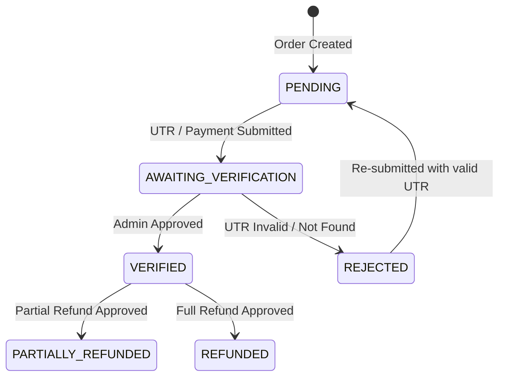

# CRAVE Billing Engine 2.0 — Payment & Refund State Machine

---

## 1. Payment State Machine

Payment states are decoupled from order fulfillment states:



---

## 2. Order Fulfillment State Machine

Order status progresses independently through fulfillment checkpoints:

```
payment_pending ➔ payment_submitted ➔ payment_verified ➔ sent_to_vendor ➔ preparing ➔ packing ➔ ready_for_pickup ➔ rider_assigned ➔ picked_up ➔ out_for_delivery ➔ delivered ➔ completed
```

---

## 3. Cancellation & Refund Matrix

| Cancellation Trigger  | Stage                           | Customer Refund          | Vendor Payout      | Rider Compensation |
| :-------------------- | :------------------------------ | :----------------------- | :----------------- | :----------------- |
| **Customer Cancels**  | Before Payment Verification     | **100% Refund**          | ₹0                 | ₹0                 |
| **Customer Cancels**  | After Vendor Acceptance         | **50% Cancellation Fee** | 50% Food Subtotal  | ₹0                 |
| **Vendor Rejection**  | Kitchen Busy / Out of Stock     | **100% Refund**          | ₹0                 | ₹0                 |
| **Rider Unavailable** | Dispatch Timeout (>15 min)      | **100% Refund**          | 100% Food Subtotal | ₹0                 |
| **Delivery Failure**  | Customer Unreachable at Address | **0% Refund**            | 100% Food Subtotal | 100% Rider Payout  |
