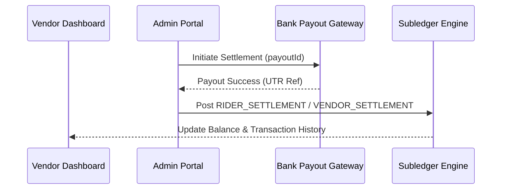

# CRAVE Billing Engine 2.0 — Settlement & Reconciliation Specification

---

## 1. Vendor Settlement Formula

$$\text{VendorPayableNet} = \text{GrossSales} - \text{CommissionDeducted} - \text{VendorDiscounts} + \text{PackagingFee}$$

- **Gross Sales**: Sum of eligible menu item prices.
- **Commission Deducted**: Contractual commission rate applied to selected commission basis (`ITEM_SUBTOTAL` or `ORDER_SUBTOTAL`).
- **Packaging Fee**: Passed through 100% to restaurant vendor.

---

## 2. Rider Compensation Formula

$$\text{RiderPayable} = \text{BasePay} + \text{DistancePay} + \text{Incentives} + \text{RiderTip}$$

- **Base Pay**: $₹20$ per completed delivery.
- **Distance Pay**: $₹6/\text{km}$ beyond included base distance.
- **Rider Tip**: 100% customer tip pass-through (exempt from commission/tax).

---

## 3. Reconciliation Workflow

